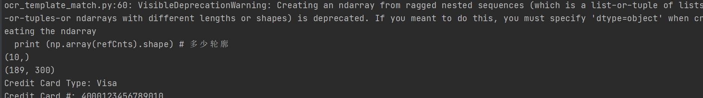

@Author:	Runsen

 基于opencv信用卡数字识别项目实战，来源；https://www.bilibili.com/video/BV1oJ411D71z?t=11&p=9。

思路：对信用卡进行灰度、二值图、计算轮廓，最后遍历每一个轮廓中的数字，根据坐标进行数字提取。项目地址： 

项目运行：

```
python ocr_template_match.py --image images/credit_card_01.png --template images/ocr_a_reference.png
```

效果图



